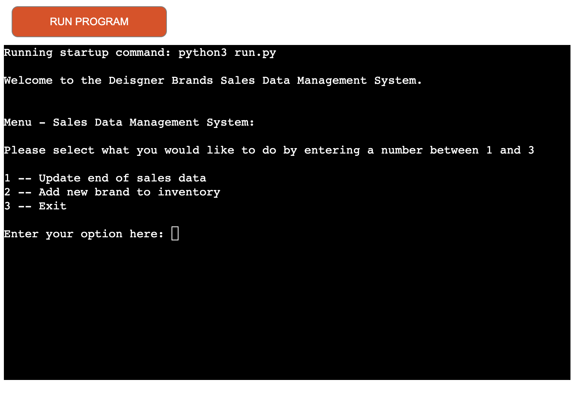
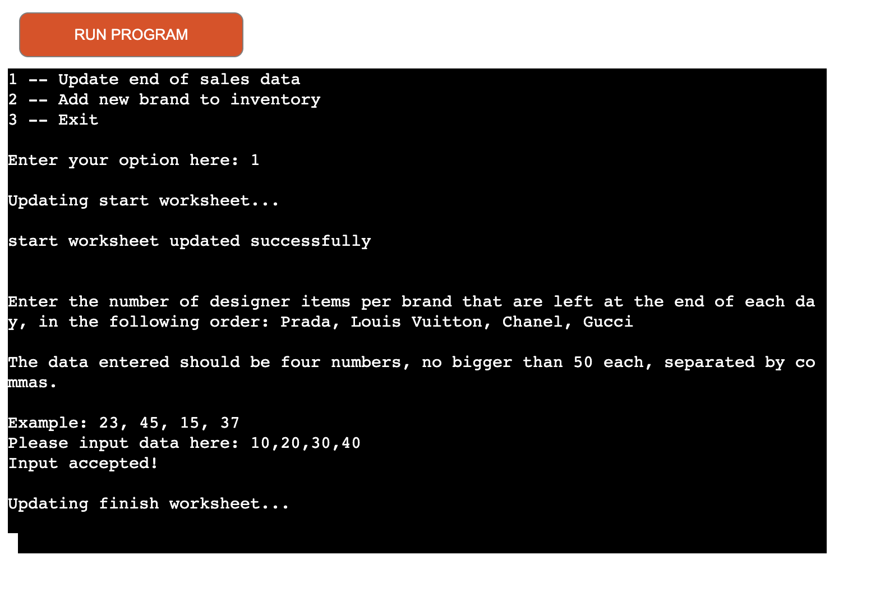
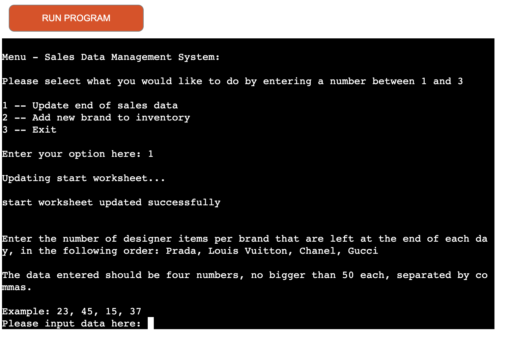

# Shopping Spree Application

This application was designed to work as a sales data management system/platform to allow the end user to update their inventory system based upon their stock levels. The platform also allows users to add new brands to their inventory ensuring users are able to keep track of their businesses.

The user is able to interact with the platform in 3 main ways, to update their end of day sales, to add a new brand to their inventory and to exit the program. The platform takes all this data from  an external Google Spreadsheet.

 "Application")

[Link to the live project](https://shopping-spree-aaf5c7927c30.herokuapp.com/)

User Goals
  -	User-friendly including easy navigation and easy instructions. 
  -	Allows users to carry out their basic stock/inventory management activities.

Developer Goals 
  -	Create a platform that allows for stock taking easily.
  -	To provide a fun and easy user experience!

# User Experience (UX)

The target client for this platform is:

-	New business owner.
-	In need of a sales data management platform.
-   small boutique businesses.

Key benefits of this platform:
-	Easy to navigate.
-	Simple instructions and functionality allowing boutique business owners to use freely and easily.
-	Easy access to the required information without too much information overload or grpahics.

# Flow Charts

All flow charts and brainstorming where created by book and paper.

# Languages Used

Python was used to complete this project. With some basic html and javascript already built into the code institute template.

# Programs & Technologies Used

- Heroku: To deploy the application and provides an enviroment in which the code can execute.
- Github: Used as the repository for the projects code after being pushed from Git
- Git: Used for version control by the Gitpod terminal to add, commit and push using git add ., git commit -m and git push.
- Google Spreadsheets: The external data house for all data pulled into creating the platform including stock, stock levels, and brand sold.
- Google Drive API: Generates credentials used in the project to access the Google Spreadsheet
- Google Sheets API: Supports the interactions such as editing, writing and reading functionality between the code and the data stored in Google Spreadsheet.
- gspread: Python API for Google Sheets
- Google Auth: Google authentication library for Python required to use the credentials generated for Google Drive API

# Features

###  Functionality 

Home - Menu 

Menu displays three options mentioned above and below. Allows for simple interaction with the platform.

Option 1 and 2 - 

Clear instructions are provided to the user as to the type of data to input. If this is done incorrectly an invalid data message is displayed and the user is encouraged to try again as the instructions loops back again until the correct data is inputted. 

Option 3 - Exit

This function is very simple and allows users to enter the number '3' to exit the program. If this option is picked a simple thank you, goodbye! message is displayed signalling to users that they have exited the program correctly.

#  Deployment

How to Clone

1. Go to the https://github.com/safiaj/shopping-spree repository 
2. Click the Code button to the left of the green Gitpod button, then click the overlapping boxes next to your new hyperlink to copy to clipboard
4. Open your own terminal in your editor and change the current working directory to the location of where you want the 
   cloned directory to be. 
5. In the terminal type git clone, and then paste the URL you copied from the repository page. 
6. Press enter to complete.

 

### Create and configure the Google spreadsheet and APIs

Steps modified from Love Sandwiches Module -

1. Log in (or create) to your Google account
2. Create a Google Spreadsheet on Google Drive. This application google spreadsheet is named 'shopping-spree' and consists of one spreadsheet with multiple worksheets ('start, 'finish' and 'sold')
3. Create headings and data for your intended purpose. For this project the headings for the table corresponded with the brands sold at the users store, and the rows where either 'start' of day stock levels, 'finish' end of day stock levels or 'sold' items per day going from Monday to Thursday.
5. Set up APIs on the [Google Cloud Platform]
6. Create a new project, by clicking on the “Select a project” button and then select “new project”. 
7. Give the project a unique name, click “Select Project”, go to dashboard
8. Setup Google Drive credentials
9. From the menu now select "APIs and Services" then "Library"
10. Search for Google Drive API
11. Select Google Drive API, click on the 'enable' button, which will take you to the API overview page.
12. Click the “Create credentials” button, then complete the form.
13. From the "Which API are you using?" dropdown menu, choose Google Drive API
14. For the "What data will you be accessing?" question, select Application Data
15. For the "Are you planning to use this API with Compute Engine, Kubernetes Engine, App Engine, or Cloud Functions?"     question, select No, I'm not using them
16. Click Next
17. Enter a Service Account name, then click Create
18. In the Role Dropdown box choose Basic > Editor then press Continue
19. This will redirect to the next page, where those options can be left blank, click Done
20. On the next page, click on the Service Account that has been created
21. On the next page, click on the Keys tab
22. Click on the Add Key dropdown and select Create New Key
23. Select JSON and then click Create, which will trigger your credentials file to be downloaded  
    into our computer files
24. You also need to enable your Google Sheets API. So go back to the library again, and search for “google sheets”.  
25. Select the Google Sheets API, then click “enable” (there's no need for more credentials here)
Now you have your APIs enabled, and have your credentials file downloaded.  
26. locate the downloaded json credentials file and drag and drop it into your Gitpod workspace.
27. Rename it to "creds.json" to make it easier to use
28. Open up the json file and find the client_email value here, copy this email address generated for your credentials. 
29. Go back to your spreadsheet and click the share button here
30. Paste in the client email, make sure “Editor” is selected, untick “Notify People”, and then click "share"
31. Make sure that gitignore file contains your creds.json file, then save and commit
32. Install gspread and google-auth libraries in the development environment using the 
    command 'pip3 install gspread google-auth'

### How to Fork

1. Go to the https://github.com/safiaj/shopping-spree repository 
2. Click the fork button on the left-hand side of the screen (on a macbook) so it may be placed elsewhere based on your device. 

 

### Deployment to Heroku

The Project Portfolio Milestone 3 project is to be deployed on Heroku. See steps below adapted from the Love Sandwiches Module.

1. Add dependencies in GitPod to requirements.txt file with command "pip3 freeze > requirements.txt"
2. Commit and push to GitHub
3. Go to the Heroku Dashboard
4. Click "Create new app"
5. Name app and select location
6. Choose the Settings tab and add Config Vars for Creds and Port (creds.json file)
   (as a second entry also add PORT for the key and 8000 for the value)
7. Add the buildbacks to Python and NodeJS in that order
8. Now go to Deploy tab
9. Select GitHub as deployment method
10. Connect to GitHub and link to repository
11. Enable automatic deployment or deploy manually
12. Click on Deploy

 

# Testing

All python code was ran through several python validators including PEP8 and pythonchecker.

### Manual Testing

**Menu:** 'Run program' option ensures the platform loads properly and the menu is displayed properly. The menu is also displayed after the completion of each option (1-3). The program terminates and provides a confirmation message when option 3 to exit is picked. Enter any data other than what is instructed and an 'Invalid Data' message is displayed and the menu options appear again prompting users to try again.

 "Updating spreadsheet")

**Option 1 - Update end of day sales data:** Enter number 1 which confirms a message is displayed with next steps and confirmation that the right sheets on the google spreadsheet will be updated in line with the functionality for this option. 
**Validation:** Press enter or input one or incorrect lines of data that confirms an error message is displayed explaining that the input data is an invalid option, reminding the user of the menu options and allowing them to re-input correct data. 
**Functionailty:** Enter valid values, but more values than the items currently sold and an invalid data option appears and a message informing users of the number of values they have entered and what they should be entering. i.e. 'The data entered should be four numbers, no bigger than 50 each, separated by commas.'

 "Functionality")

![Application]! (readme-images/Option-1-Invalid-Data.png)"Option 1 Invalid data")

**Option 2 - Add new brand to inventory:** Enter the number 2 then hit enter to confirm that a message is displayed explaining what the user needs to do next, including the required user input and an example.
**Validation:** Enter more or less than the required amount of details to confirm that an error message is displayed explaining that the input data is invalid, and reminding the user of the requirements and the number of details entered. Enter the correct amount of details with one detail not being a number to confirm that an error message is displayed explaining that the input data is invalid, and also printing out the invalid detail that was entered, along with the requirement that it needs to be a float or an integer.
**Functionailty:** Enter valid values to confirm that the application displays multiple messages to reassure the user that their request is being processed. A confirmation of the updated spreadsheet is then posted to the user. The googlesheet should be opened to ensure this has pulled through and is displaying the correct data.

![Application]! (readme-images/Option-2-functionality.png) "Option 2 Functionality")

![Application]! (readme-images/Option-2-Invalid-Data.png) "Option 2 Invalid Data")

![Application]! (readme-images/Option-2-Input-Accepted.png) "Option 2 Inputted Accepted")

**Option 3 - Exit:** Type the number 3 and press enter to confirm that the goodbye message is displayed, and the application terminates.

![Application]! (readme-images/Option-3-Exit-Platform.png) "Option 3 Exit Platform")

###  Further testing

I used various devices to ensure the platform worked for most devices on the market including phones, ipads, laptops and computers. From this I was able to also confirm that the platform would only work on Google Chrome.

## Bugs

A common issue I encountered was not providing enough information to the user at the platform interface leaving it in a lacklustre state and potentially losing out on providing an excellent user experience. To combat this I decided to add extra functionality in the form of the following code: "print(f"\nThe following brand: {corresponding_data.upper()}, has sold the most items today with only {finish_data[lowest_finish_index]} items left over!\n")" code like this enables users to understand their top seller items quickly and conveniently.

## Data model, application features and business logic

The intended project functionality was to create a multi-functional program allowing users to access separate areas of the platform. This was done through creating a 'Menu'. We can assume that a business owner needs more than one option when stock/inventory taking and managing. The most vital of these is ensuring accurate measurment of the stock available and sold over a period of time. 

The menu option allows users to go in any order they like. There are no restrictions in going from option 1 - 3 or in any order. 

Option 1 allows users to update their end of day sales. As we've assumed this is for new business owners the starting stock level for the day is the same while the user for ease. This can easily be changed to remove the restrictions placed on the code.

Option 2 allows users to add new items/brands to their inventory. This can be done at any time and has the same parameters as the previous option. This data is added to the google sheet only when following the guidance provided which is no more than 4 days worth of data at a time and users are unable to start with more than 50 items per day per brand. This is updated into the google spreadsheet. 

Option 3 allows users to exit the system once they have completed their inputs. This option does not affect the attached google spreadsheet.

The External Google Sheet is used to store and manage the data for this system, including brand names, units, days, and end of day stock levels

The Google spreadsheet that the platform utilises includes the following initial data, which was set up manually by the developer:

[See it live here](https://docs.google.com/spreadsheets/d/15DB3GqIYlu6KgncQkKKg8oBoI8By6Ys3AKdRRahelNs/edit?usp=sharing)

## Acknowledgments

The following acknowledgments would be appropriate for this project. The inspiration for this project came partly from the love sandwiches module but was further enhanced through my experience in stock taking/inventory management. I recieved support not only through the course but through personal avenues and various websites to understand how my code should work. I also did prior research looking at other students previous work in understanding what is required of me to pass this milestone project. 

The below websites have been used to understand the logic of building this project with Python.

How to convert data into integers and floats

https://stackoverflow.com/questions/74665788/how-to-convert-string-to-number-in-python
  
General updates of rows/columns.

https://docs.gspread.org/en/latest/user-guide.html#updating-cells
https://docs.gspread.org/en/latest/user-guide.html#getting-all-values-from-a-row-or-a-column

Creating a Menu

https://computinglearner.com/how-to-create-a-menu-for-a-python-console-application/?utm_content=cmp-true

